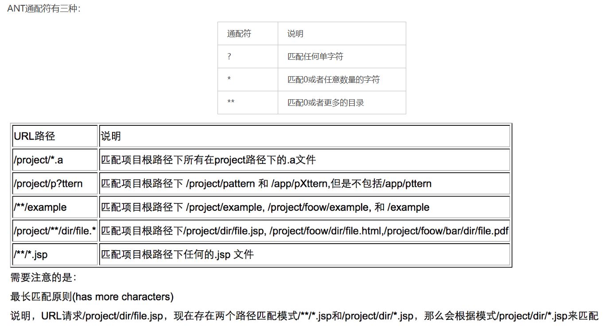

# Git

## 本地仓库与远程仓库关联?

1. 在远程仓库（例如GitHub、GitLab等）上创建一个空的仓库，获取远程仓库的URL地址。

2. 在本地的git仓库目录下使用以下命令将本地仓库关联到远程仓库：

   ```
   git remote add origin 远程仓库的URL地址
   ```

3. 可以使用以下命令验证是否成功关联：

   ```
   git remote -v
   ```

4. 最后，使用以下命令将本地代码推送到远程仓库：

   ```
   git push -u origin master
   ```

## 如何删除远程分支？

```
git branch -r
git push origin --delete master
```

# Spring

## Spring配置类的作用

在Spring中，配置类的作用是用于配置和定义应用程序中的Bean和其他组件。通过配置类，开发者可以替代传统的XML配置方式，以Java代码的形式来定义应用程序的组件、依赖关系、和其他配置信息。

Spring的配置类使用注解`@Configuration`进行标记，它告诉Spring容器该类是一个配置类。配置类通常包含一系列用`@Bean`注解标记的方法，这些方法返回的对象会被Spring容器实例化并纳入应用程序的上下文中。

配置类可以用于定义数据源、事务管理器、各种服务、持久化层组件等。它们还可以配置各种Spring框架的特性和功能，如**AOP**、**事务管理**、国际化等。

使用配置类的好处是它更加类型安全，可以通过Java代码来进行配置，避免了繁琐的XML配置，并提供了更好的代码组织和维护性。同时，配置类也可以与其他注解一起使用，如`@ComponentScan`、`@EnableAutoConfiguration`等，进一步简化配置工作。

## WebMvcConfigurationSupport类的作用

WebMvcConfigurationSupport是Spring Framework中的一个类，它是用于配置Web MVC的支持的基类。在Spring Boot应用中，我们可以通过继承WebMvcConfigurationSupport类，并重写其中的方法来自定义Web MVC的配置。

WebMvcConfigurationSupport类的主要作用有以下几点：

1. 提供自定义配置：通过继承WebMvcConfigurationSupport类，我们可以重写其中的方法来自定义Web MVC的配置，例如添加拦截器、配置视图解析器、设置跨域访问等。
2. 替代Spring Boot的自动配置：当我们继承WebMvcConfigurationSupport类时，Spring Boot的自动配置会被禁用，从而允许我们完全控制Web MVC的配置。
3. 兼容WebMvcConfigurer接口：WebMvcConfigurationSupport类实现了WebMvcConfigurer接口，因此我们也可以通过实现WebMvcConfigurer接口来自定义Web MVC的配置。不过，使用WebMvcConfigurationSupport类可以更方便地集成其他配置。

**需要注意的是，使用WebMvcConfigurationSupport类时，需要谨慎处理，因为它会完全覆盖Spring Boot的自动配置，可能会导致一些问题。**通常情况下，推荐使用WebMvcConfigurer接口来进行局部的Web MVC配置，而不是直接继承WebMvcConfigurationSupport类。这样可以更好地与Spring Boot的自动配置进行整合，避免不必要的冲突和复杂性。

## 过滤器和拦截器的区别

过滤器（Filter）和拦截器（Interceptor）都是Spring框架中用于对请求进行预处理和后处理的组件，但它们之间有一些区别：

1. 定义位置：
   - 过滤器是Servlet规范中的一部分，由Servlet容器负责管理，因此不属于Spring框架的一部分。过滤器在请求到达Servlet之前进行预处理，响应返回给客户端之前进行后处理。
   - 拦截器是Spring框架自己实现的一部分，由Spring容器负责管理。拦截器是在Spring MVC框架中生效，可以拦截Controller的请求处理。
2. 依赖：
   - 过滤器依赖于Servlet容器，它与具体的应用框架无关，可以在任何支持Servlet规范的容器中使用。
   - 拦截器是Spring框架的一部分，依赖于Spring容器。
3. 配置方式：
   - 过滤器的配置是在web.xml中进行的，由Servlet容器管理。
   - 拦截器的配置是在Spring的配置文件中进行的，由Spring容器管理。
4. 执行顺序：
   - 过滤器是在请求到达Servlet之前进行预处理，响应返回给客户端之前进行后处理，因此它的执行顺序是在Servlet之前。
   - 拦截器是在请求到达Controller之前进行预处理，响应返回给客户端之前进行后处理，因此它的执行顺序是在Controller之前。
5. 功能范围：
   - 过滤器可以在整个应用中进行拦截，对所有请求起作用。
   - 拦截器只对Spring MVC中的Controller请求起作用，它可以根据需要选择拦截哪些请求。

总的来说，过滤器更加通用，适用于所有Servlet规范的应用，而拦截器是Spring框架提供的一种更加灵活和强大的请求拦截方式，适用于Spring MVC应用。

## Servlet过滤器

[Servlet过滤器_servlet filter init-param_pan_junbiao的博客-CSDN博客](https://blog.csdn.net/pan_junbiao/article/details/88353292)

## SpringMVC拦截器

[Spring MVC 系列之拦截器 Interceptor 最全总结_springmvc interceptor_大鹏cool的博客-CSDN博客](https://blog.csdn.net/zzuhkp/article/details/121242297)

## AntPathMatcher路径匹配器

### Ant风格



### AntPathMatcher的使用

直接调用里面的match函数，很方便

## DigestUtils工具类

许多加密相关的算法，比如md5，SHA-1、SHA-256等，可以系统的学习一下这些算法

同时Spring的utils工具类也可以系统的学习一下

## 注解

### @ControllerAdvice注解

`@ControllerAdvice`是Spring框架中的一个注解，用于定义全局控制器增强（Global Controller Advice）。它允许在多个控制器中共享相同的行为或异常处理逻辑，并将其集中到一个单独的类中，以便于维护和重用。

具体来说，`@ControllerAdvice`注解的作用有以下几个方面：

1. 异常处理：可以使用`@ExceptionHandler`注解在`@ControllerAdvice`类中定义全局异常处理方法，用于处理应用程序中抛出的特定异常或所有未处理的异常。这样，不需要在每个控制器中都写相同的异常处理逻辑。
2. 全局数据绑定：可以使用`@ModelAttribute`注解在`@ControllerAdvice`类中定义全局的数据绑定方法，用于将某些数据添加到所有控制器的模型中。这样，这些数据就可以在多个控制器中共享，避免了在每个控制器中重复设置相同的数据。
3. 全局初始化：可以使用`@InitBinder`注解在`@ControllerAdvice`类中定义全局的数据初始化方法，用于对所有控制器的表单数据进行预处理。
4. 统一的响应处理：可以使用`@ResponseBody`注解在`@ControllerAdvice`类中定义全局的响应处理方法，用于统一处理控制器方法的返回结果，例如将返回数据封装成标准格式、处理异常等。

综上所述，`@ControllerAdvice`注解的作用是将多个控制器中的相同行为和逻辑集中到一个类中，并在应用程序范围内进行统一管理和处理，从而提高代码的复用性和可维护性。

`@ExceptionHandler`是Spring框架中的一个注解，用于在`@ControllerAdvice`类或控制器类中定义异常处理方法。当在控制器中的某个方法抛出指定类型的异常时，`@ExceptionHandler`注解所标注的方法会被自动触发，用于处理该异常。

具体来说，`@ExceptionHandler`的作用有以下几个方面：

1. 异常处理：通过在`@ExceptionHandler`注解标注的方法中定义异常处理逻辑，可以在应用程序出现异常时，捕获并处理这些异常，从而提供友好的错误信息或进行特定的操作。
2. 集中处理异常：`@ExceptionHandler`注解通常与`@ControllerAdvice`注解一起使用，可以将异常处理逻辑集中到一个类中，称为全局异常处理器。这样可以避免在每个控制器中都编写相同的异常处理逻辑，提高代码的重用性和可维护性。
3. 统一响应处理：通过异常处理方法可以将异常信息封装成标准的响应格式，返回给客户端。这样可以确保客户端得到一致的响应结构，方便客户端处理异常情况。

示例代码：

```java
@ControllerAdvice
public class GlobalExceptionHandler {
    
    @ExceptionHandler(Exception.class)
    public ResponseEntity<String> handleException(Exception ex) {
        // 自定义异常处理逻辑
        return ResponseEntity.status(HttpStatus.INTERNAL_SERVER_ERROR).body("Something went wrong!");
    }
}
```

在上述示例中，`handleException`方法使用`@ExceptionHandler`注解，用于处理`Exception`及其子类的异常。当应用程序中抛出任何`Exception`类型的异常时，该方法会被自动调用，返回一个HTTP 500错误状态码和自定义的错误信息。

### @PathVariable注解

`@PathVariable`是Spring框架中的一个注解，用于在Spring MVC控制器的方法参数中获取URL路径中的变量值。

当客户端发送HTTP请求时，如果请求的URL中包含占位符（PathVariable），比如`/users/{id}`，其中`{id}`就是一个占位符，Spring会根据`@PathVariable`注解来提取这个占位符中的值，并将其作为方法参数的值传递给控制器方法。

示例代码：

```java
@RestController
public class UserController {
    
    @GetMapping("/users/{id}")
    public ResponseEntity<User> getUserById(@PathVariable Long id) {
        // 根据id查询用户信息
        User user = userService.getUserById(id);
        if (user != null) {
            return ResponseEntity.ok(user);
        } else {
            return ResponseEntity.notFound().build();
        }
    }
}
```

在上述示例中，`getUserById`方法使用`@GetMapping`注解表示该方法处理GET请求，并使用`@PathVariable`注解来获取URL路径中的`id`值。当客户端发送请求`/users/123`时，Spring会自动提取路径中的`123`并将其传递给`getUserById`方法的`id`参数，从而实现根据ID查询用户的功能。

总结：`@PathVariable`注解用于从URL路径中获取变量值，并将其作为方法参数传递给Spring MVC控制器的方法。它简化了从URL中提取参数的操作，使得控制器方法的编写更加简洁和方便。

### @RequestParam注解

`@RequestParam`是Spring框架中的一个注解，用于在Spring MVC控制器的方法参数中获取请求参数的值。

当客户端发送HTTP请求时，如果请求中包含查询参数或表单参数，Spring会根据`@RequestParam`注解来提取这些参数的值，并将其作为方法参数的值传递给控制器方法。

示例代码：

```java
@RestController
public class UserController {
    
    @GetMapping("/users")
    public ResponseEntity<List<User>> getUsers(@RequestParam String name) {
        // 根据name查询用户列表
        List<User> userList = userService.getUsersByName(name);
        return ResponseEntity.ok(userList);
    }
}
```

在上述示例中，`getUsers`方法使用`@GetMapping`注解表示该方法处理GET请求，并使用`@RequestParam`注解来获取查询参数中的`name`值。当客户端发送请求`/users?name=John`时，Spring会自动提取查询参数中的`name=John`并将其传递给`getUsers`方法的`name`参数，从而实现根据名称查询用户列表的功能。

总结：`@RequestParam`注解用于从请求参数中获取值，并将其作为方法参数传递给Spring MVC控制器的方法。它可以用于获取查询参数、表单参数等类型的请求参数，并且可以指定默认值、是否必需等属性，非常灵活和方便。

# Lombok

需要系统学习一下

## 什么是Lombok？

Lombok是Java开发中的一种工具库，它通过使用注解来简化Java代码的编写，减少样板代码（boilerplate code）的量，提高代码的可读性和简洁性。

Lombok提供了许多注解，这些注解可以在编译阶段自动为类生成相应的代码，例如生成getter和setter方法、构造函数、equals和hashCode方法等。使用Lombok后，我们可以通过简单的注解来实现这些功能，而不需要手动编写重复的代码，让代码更加简洁高效。

常用的Lombok注解包括：

1. @Getter和@Setter：自动生成字段的getter和setter方法。
2. @ToString：自动生成toString方法。
3. @EqualsAndHashCode：自动生成equals和hashCode方法。
4. @NoArgsConstructor：自动生成无参构造函数。
5. @AllArgsConstructor：自动生成全参构造函数。
6. @Data：自动生成所有字段的getter、setter、equals、hashCode和toString方法。

除了上述常用注解外，Lombok还提供了其他方便的注解，可以根据项目的需要进行选择和使用。Lombok的使用大大简化了Java代码的编写，提高了开发效率，因此在许多Java项目中被广泛使用。

# Slf4j

## 什么是Slf4j？

Slf4j（Simple Logging Facade for Java）是一个Java日志框架，用于在代码中记录日志信息。它提供了一种简单的抽象层，使得开发者可以在代码中使用统一的日志接口，而不用直接依赖于具体的日志实现。

Slf4j的设计目标是为了解决Java应用中日志框架的多样性和复杂性问题。在Java开发中，常见的日志框架有Log4j、java.util.logging、Logback等，它们各自有不同的API和配置方式。这样在项目中使用不同的日志框架可能会导致代码的耦合性增加，维护和切换日志框架也会变得复杂。

Slf4j的优点在于它提供了一套统一的接口，可以将日志信息传递给底层具体的日志实现框架。这样，开发者在代码中只需要使用Slf4j提供的接口，而不用关心具体的日志实现。同时，Slf4j还支持运行时动态绑定日志实现，可以在不修改代码的情况下切换底层的日志框架。

使用Slf4j的步骤一般包括以下几个部分：

1. 在项目中引入Slf4j库的依赖。
2. 在代码中使用Slf4j提供的接口记录日志信息，如Logger接口。
3. 配置底层的日志实现，通常是通过在项目的配置文件中指定具体的日志框架。

总的来说，Slf4j为Java开发者提供了一种简单、统一且灵活的方式来管理日志输出，使得日志记录变得更加便捷和易于维护。

# MyBatis-Plus

先不记录，后面需要系统性的学习

# fastjson

先不记录，后面需要系统新的学习

# 雪花算法

系统学习